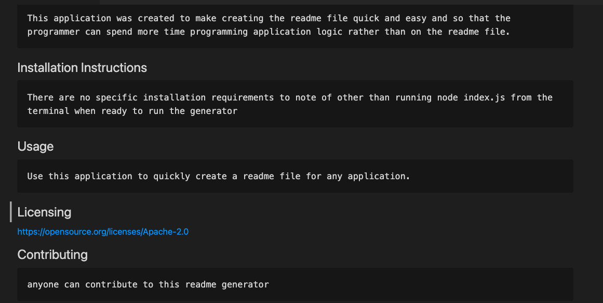

# README Generator 
  

## Table of Contents 
- [README Generator](#readme-generator)
  - [Table of Contents](#table-of-contents)
  - [Description](#description)
  - [Installation Instructions](#installation-instructions)
  - [Usage](#usage)
  - [Licensing](#licensing)
  - [Contributing](#contributing)
  - [Tests Code](#tests-code)
  - [Questions](#questions)
  - [Screen Shots and Video](#screen-shots-and-video)
    
## Description
    This application was created to make creating the readme file quick and easy and so that the programmer can spend more time programming application logic rather than on the readme file.
    
## Installation Instructions 
    There are no specific installation requirements to note of other than running node index.js from the terminal when ready to run the generator

## Usage
    Use this application to quickly create a readme file for any application.
    
## Licensing
https://opensource.org/licenses/Apache-2.0      

    
## Contributing
    anyone can contribute to this readme generator
    
## Tests Code
    to test, we run node index.js from the folder housing the index.js file for this application.  Complete the questions and review the readme that is generated.
    
## Questions
    
You can find me here on [GitHub](http://github.com/daze77), or contact me via [email](mailto:daze77@gmail.com) 

## Screen Shots and Video

Please find screenshots and a brief video showcasing the application below

Link to video - Note the video is too large to show in GitHub and must be downloaded to view!

https://github.com/daze77/READMEGenerator/blob/master/Assets/images/readmeGeneratorVid.mp4

GitHub Link:

https://github.com/daze77

GitHub Readme Generator Repo:

https://github.com/daze77/READMEGenerator

    